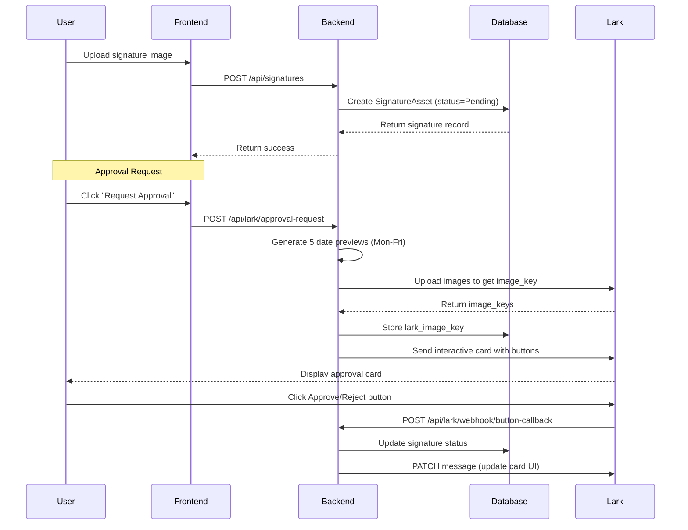

# DL Generator v3.0 - Technical Documentation

**Focus: eSignature Configuration, Lark Custom Bot Integration & Tech Stack**

---

## Executive Summary

The DL Generator is a fully independent, self-service Demand Letter system with:

- ✅ Secure, admin-managed signature asset with automated handwritten-style date rendering
- ✅ Lark Bot integration for approval workflows via Message Card Builder
- ✅ PyTorch-based handwriting synthesis for date generation
- ✅ Modern frontend with Tailwind CSS v4.1.3 for AWS EC2 deployment compatibility

---

## 1. Tech Stack Architecture

### Backend Stack

| Component           | Technology                   | Version |
| ------------------- | ---------------------------- | ------- |
| Framework           | FastAPI                      | 0.115.0 |
| ASGI Server         | Uvicorn                      | 0.30.6  |
| Database            | SQLite + SQLAlchemy Async    | 2.0.35  |
| Async SQLite Driver | aiosqlite                    | 0.20.0  |
| HTTP Client         | httpx                        | 0.27.2  |
| ML Framework        | PyTorch                      | ≥2.0.0  |
| Image Processing    | Pillow, OpenCV, scikit-image | Latest  |
| Validation          | Pydantic                     | 2.9.2   |

### Frontend Stack

| Component     | Technology               | Version |
| ------------- | ------------------------ | ------- |
| Framework     | React                    | 18.3.1  |
| Build Tool    | Vite                     | 6.3.5   |
| Compiler      | @vitejs/plugin-react-swc | 3.10.2  |
| UI Components | Radix UI                 | Various |
| Utility       | tailwind-merge, clsx     | Latest  |
| Icons         | Lucide React             | 0.487.0 |
| Toast         | Sonner                   | 2.0.3   |
| Charts        | Recharts                 | 2.15.2  |

### Infrastructure

| Component           | Detail                              |
| ------------------- | ----------------------------------- |
| Production Server   | AWS EC2                             |
| Development IPs     | 172.20.0.121:8000, 172.20.0.86:8000 |
| Tunnel for Webhooks | ngrok                               |
| FTP Deployment      | Yes                                 |

---

## 2. Project Structure

```
Dlgeneratorappredesign/
├── backend/                           # Python FastAPI backend
│   ├── main.py                        # App entry point with lifespan events
│   ├── requirements.txt               # Python dependencies
│   ├── app/
│   │   ├── database.py                # SQLAlchemy models & init
│   │   ├── routers/
│   │   │   ├── lark_bot.py            # Lark webhook & approval endpoints
│   │   │   ├── signatures.py          # Signature CRUD operations
│   │   │   ├── handwriting.py         # Handwriting generation endpoints
│   │   │   ├── users.py               # User management endpoints
│   │   │   ├── audit.py               # Audit trail endpoints
│   │   │   ├── templates.py           # Document template endpoints
│   │   │   ├── dl_generator.py        # DL generation jobs
│   │   │   └── previews.py            # Preview image endpoints
│   │   ├── services/
│   │   │   ├── lark_approval_service.py      # Message Card Builder integration
│   │   │   ├── lark_bot_service.py           # Legacy webhook service
│   │   │   ├── lark_card_update_service.py   # Card update on button click
│   │   │   ├── handwriting_gan.py            # PyTorch handwriting synthesis
│   │   │   ├── date_preview_service.py       # Date preview generation
│   │   │   ├── auto_approval_scheduler.py    # Sunday auto-approval
│   │   │   ├── preview_storage.py            # Preview file management
│   │   │   ├── lark_preview_cache.py         # In-memory cache
│   │   │   └── lark_image_cache.py           # Lark image key cache
│   │   └── utils/
│   │       ├── timezone.py            # Philippines timezone helpers
│   │       ├── active_signature.py    # Active signature utilities
│   │       └── structured_logger.py   # Event logging
│   ├── database/                      # SQLite database files
│   └── uploads/                       # Signature files storage
│       ├── signatures/                # Uploaded signature images
│       ├── generated/                 # Generated composites
│       ├── templates/                 # Document templates
│       └── lark_previews/             # Lark-ready preview images
├── src/                               # React frontend
│   ├── index.css                      # Global CSS
│   ├── styles/globals.css             # CSS custom properties
│   ├── App.tsx                        # Main app entry
│   ├── AppModern.tsx                  # Modern theme entry
│   ├── AppLawFirm.tsx                 # Law Firm theme entry
│   ├── components/
│   │   ├── SignatureConfig.tsx        # Signature management (Modern)
│   │   ├── Dashboard.tsx              # Main dashboard
│   │   ├── CustomDateRenderer.tsx     # Handwritten date renderer
│   │   ├── UserManagement.tsx         # User CRUD
│   │   ├── TemplateManagement.tsx     # Template management
│   │   ├── AuditTrail.tsx             # Audit log viewer
│   │   ├── LarkPreviewPage.tsx        # Lark preview debug page
│   │   ├── lawfirm/                   # Law Firm theme components
│   │   └── ui/                        # Shared UI components
│   └── main.tsx
├── sign/                              # Signature & date font assets
│   ├── datefont/                      # Handwritten digit images (0-9, dot)
│   ├── lark_preview_images/           # Generated Lark previews
│   └── *.png                          # Signature files
├── tools/                             # Utility scripts
├── package.json                       # Frontend dependencies
└── vite.config.ts                     # Vite configuration
```

---

## 3. eSignature Configuration System

### 3.1 Database Schema

```sql
-- Signature Assets Table
CREATE TABLE signature_assets (
    id INTEGER PRIMARY KEY AUTOINCREMENT,
    file_path VARCHAR(500) NOT NULL,
    file_name VARCHAR(255) NOT NULL,
    uploaded_by INTEGER REFERENCES users(id),
    status VARCHAR(50) DEFAULT 'Pending',  -- Pending, Approved, Rejected
    validity_period VARCHAR(100) DEFAULT 'Indefinite',
    purpose VARCHAR(255) DEFAULT 'DL Generation',
    admin_message TEXT,
    approved_by VARCHAR(255),
    approved_at DATETIME,
    style_vector TEXT,             -- For GAN style transfer
    lark_image_key VARCHAR(255),   -- Uploaded to Lark for cards
    created_at DATETIME,
    updated_at DATETIME
);

-- Approval Requests Table
CREATE TABLE signature_approval_requests (
    id INTEGER PRIMARY KEY AUTOINCREMENT,
    signature_id INTEGER REFERENCES signature_assets(id),
    requested_by INTEGER REFERENCES users(id),
    status VARCHAR(50) DEFAULT 'Pending',
    lark_message_id VARCHAR(255),  -- Lark message for card updates
    lark_user_id VARCHAR(255),
    responded_at DATETIME,
    responded_by VARCHAR(255),
    response_reason TEXT,
    created_at DATETIME
);

-- Lark Bot Configuration
CREATE TABLE lark_bot_config (
    id INTEGER PRIMARY KEY AUTOINCREMENT,
    webhook_url VARCHAR(500),
    secret_key VARCHAR(255),       -- App Secret
    app_id VARCHAR(255),           -- cli_xxxxx
    template_id VARCHAR(255),      -- ctp_xxxxx (Message Card Builder)
    self_user_id VARCHAR(255),     -- ou_xxxxx (open_id)
    is_active BOOLEAN DEFAULT TRUE,
    last_used_at DATETIME,
    created_at DATETIME,
    updated_at DATETIME
);

-- Lark Recipients
CREATE TABLE lark_recipients (
    id INTEGER PRIMARY KEY AUTOINCREMENT,
    name VARCHAR(255) NOT NULL,
    email VARCHAR(255),
    open_id VARCHAR(255) UNIQUE NOT NULL,
    created_at DATETIME
);

-- Lark Approval Messages (per recipient tracking)
CREATE TABLE lark_approval_messages (
    id INTEGER PRIMARY KEY AUTOINCREMENT,
    approval_request_id INTEGER REFERENCES signature_approval_requests(id),
    recipient_open_id VARCHAR(255) NOT NULL,
    message_id VARCHAR(255) NOT NULL,
    created_at DATETIME
);

-- Event Deduplication
CREATE TABLE lark_event_dedupe (
    id INTEGER PRIMARY KEY AUTOINCREMENT,
    event_id VARCHAR(255) UNIQUE NOT NULL,
    event_action VARCHAR(50),
    open_message_id VARCHAR(255),
    signature_id INTEGER,
    operator_open_id VARCHAR(255),
    operator_user_id VARCHAR(255),
    created_at DATETIME
);
```

### 3.2 Signature Upload Flow



### 3.3 API Endpoints

#### Signature Management

| Method | Endpoint                        | Description                  |
| ------ | ------------------------------- | ---------------------------- |
| GET    | `/api/signatures`               | List all signatures          |
| GET    | `/api/signatures/{id}`          | Get single signature         |
| POST   | `/api/signatures`               | Upload new signature         |
| PATCH  | `/api/signatures/{id}/approve`  | Approve signature            |
| PATCH  | `/api/signatures/{id}/reject`   | Reject signature             |
| DELETE | `/api/signatures/{id}`          | Delete signature             |
| GET    | `/api/signatures/status/active` | Get current active signature |

#### Lark Bot Configuration

| Method | Endpoint                            | Description               |
| ------ | ----------------------------------- | ------------------------- |
| GET    | `/api/lark/config/openapi`          | Get Open API config       |
| POST   | `/api/lark/config/openapi`          | Save Open API config      |
| POST   | `/api/lark/send-approval`           | Send approval request     |
| POST   | `/api/lark/webhook/button-callback` | Receive button clicks     |
| GET    | `/api/lark/recipients`              | List recipients           |
| POST   | `/api/lark/recipients`              | Add recipient             |
| DELETE | `/api/lark/recipients/{id}`         | Remove recipient          |
| GET    | `/api/lark/available-recipients`    | List Lark directory users |
| POST   | `/api/lark/verify-recipient-email`  | Verify email in Lark      |
| GET    | `/api/lark/scheduler/status`        | Check scheduler status    |
| POST   | `/api/lark/scheduler/trigger`       | Manual trigger            |

---

## 4. Lark Custom Bot Integration

### 4.1 Architecture Overview

```
┌─────────────────────────────────────────────────────────────────┐
│                     LARK INTEGRATION FLOW                       │
├─────────────────────────────────────────────────────────────────┤
│                                                                 │
│  ┌──────────────┐     ┌──────────────┐     ┌──────────────┐   │
│  │   Backend    │────▶│    ngrok     │────▶│  Lark API    │   │
│  │ (FastAPI)    │◀────│   Tunnel     │◀────│  (Cloud)     │   │
│  └──────────────┘     └──────────────┘     └──────────────┘   │
│         │                                          │            │
│         │ ┌─────────────────────────────────────┐ │            │
│         └─│  1. Get tenant_access_token         │─┘            │
│           │  2. Upload signature image          │              │
│           │  3. Send interactive card           │              │
│           │  4. Receive button callbacks        │              │
│           │  5. Update card (PATCH message)     │              │
│           └─────────────────────────────────────┘              │
│                                                                 │
└─────────────────────────────────────────────────────────────────┘
```

### 4.2 Lark API Endpoints Used

| API                                     | Method | Purpose                  |
| --------------------------------------- | ------ | ------------------------ |
| `/auth/v3/tenant_access_token/internal` | POST   | Get access token         |
| `/im/v1/images`                         | POST   | Upload signature image   |
| `/im/v1/messages`                       | POST   | Send interactive card    |
| `/im/v1/messages/{message_id}`          | PATCH  | Update card after action |
| `/contact/v3/users/batch_get_id`        | POST   | Resolve email to open_id |

### 4.3 Required Lark Permissions

```yaml
# Add these scopes in Lark Developer Console → Permissions & Scopes

Message Scopes:
  - im:message # Send messages
  - im:message:send_as_bot # Send as bot
  - im:chat # Access chat info

Image Upload:
  - im:image # Upload images
  - im:resource # Upload resources

User Info (for recipient lookup):
  - contact:user.base:readonly
  - contact:user.email:readonly
```

### 4.4 Button Callback Webhook

```python
# Endpoint: POST /api/lark/webhook/button-callback
# Configured in: Lark Developer Console → Event Subscriptions

@router.post("/webhook/button-callback")
async def handle_button_callback(payload: dict):
    """
    Lark Event Structure (v2.0 schema):
    {
        "schema": "2.0",
        "header": {
            "event_id": "xxx",
            "event_type": "card.action.trigger",
            "app_id": "cli_xxx"
        },
        "event": {
            "operator": {"open_id": "ou_xxx"},
            "action": {
                "value": {"action": "approve", "signature_id": 1},
                "tag": "button"
            },
            "context": {"open_message_id": "om_xxx"}
        }
    }
    """
    # Handle URL verification challenge
    if payload.get("type") == "url_verification":
        return {"challenge": payload.get("challenge", "")}

    # Process button click
    if header.get("event_type") == "card.action.trigger":
        await lark_card_update_service.process_button_callback(payload)

    # CRITICAL: Return empty {} to stop Lark loading spinner
    return {}
```

### 4.5 Interactive Card Structure

```json
{
  "header": {
    "template": "green",
    "title": { "tag": "plain_text", "content": "Signature Approval Request" }
  },
  "elements": [
    {
      "tag": "column_set",
      "columns": [
        {
          "elements": [
            { "tag": "lark_md", "content": "**Request Date:**\n..." }
          ]
        },
        {
          "elements": [
            { "tag": "lark_md", "content": "**Requested By:**\n..." }
          ]
        }
      ]
    },
    { "tag": "hr" },
    { "tag": "img", "img_key": "{{signature_image_key}}" },
    { "tag": "hr" },
    {
      "tag": "action",
      "actions": [
        {
          "tag": "button",
          "text": { "tag": "plain_text", "content": "APPROVE" },
          "type": "primary",
          "value": { "action": "approve", "signature_id": 1, "request_id": 1 }
        },
        {
          "tag": "button",
          "text": { "tag": "plain_text", "content": "REJECT" },
          "type": "danger",
          "value": { "action": "reject", "signature_id": 1, "request_id": 1 }
        }
      ]
    }
  ]
}
```

---

## 5. ngrok Setup for Webhook

### 5.1 Installation

```powershell
# 1. Download ngrok from https://ngrok.com/download
# 2. Extract to C:\ngrok
# 3. Create free account and get authtoken

cd C:\ngrok
.\ngrok config add-authtoken YOUR_TOKEN_HERE
```

### 5.2 Start Tunnel

```powershell
# Expose backend port 8000
.\ngrok http 8000

# Output:
# Session Status: online
# Forwarding: https://abc123.ngrok-free.app -> http://localhost:8000
```

### 5.3 Configure in Lark

1. Go to Lark Developer Console → Your App → Event Subscriptions
2. Set Request URL:
   ```
   https://abc123.ngrok-free.app/api/lark/webhook/button-callback
   ```
3. Click **Verify** (backend must be running)
4. Enable event: `card.action.trigger`

> ⚠️ **Note:** Free tier ngrok URLs change on restart. Update Lark webhook URL each time.

---

## 6. Handwritten Date Generation

### 6.1 CustomDateRenderer (Frontend)

**File:** `src/components/CustomDateRenderer.tsx`

```typescript
interface CustomDateRendererProps {
  date?: Date;
  className?: string;
  rotation?: number; // Default: -1° (slight tilt)
  height?: number; // Default: 24px
  dotScale?: number; // Default: 0.55
}

// Format: M.D.YY (e.g., "1.26.26" for January 26, 2026)
// Uses PNG images from sign/datefont/ for each digit
```

### 6.2 Datefont Images

**Location:** `sign/datefont/`

| File              | Content                |
| ----------------- | ---------------------- |
| `0.png`           | Handwritten zero       |
| `1.PNG` - `9.PNG` | Handwritten digits 1-9 |
| `dot.png`         | Period/dot separator   |

### 6.3 Backend Parameters (date_preview_service.py)

```python
# Preview rendering configuration
OUTPUT_WIDTH = 400
OUTPUT_HEIGHT = 160
DATE_FONT_HEIGHT = 22
ROTATION_DEG = -8.0           # Container rotation
DATE_ROTATION_DEG = -20.0     # Date rotation within container
DATE_WIDTH_RATIO = 0.45
DATE_MARGIN_LEFT_RATIO = 0.205
OVERLAP_PX = 34               # Signature overlaps date by 34px
DOT_SCALE = 0.55              # Dot scaled to 55% of digit height
```

### 6.4 HandwritingGAN Service

**File:** `backend/app/services/handwriting_gan.py`

Key methods:

| Method                                   | Purpose                           |
| ---------------------------------------- | --------------------------------- |
| `composite_signature_with_custom_date()` | Create signature+date composite   |
| `_render_date_with_custom_font()`        | Render date using digit images    |
| `_load_custom_datefont_images()`         | Load and cache digit images       |
| `generate_weekday_dates()`               | Generate Mon-Fri dates for a week |

---

## 7. Auto-Approval Scheduler

### 7.1 Sunday Auto-Request Flow

```python
# Runs every Sunday at 9:00 AM PHT
# Retries hourly if no response received

async def start_scheduler(self):
    """Start the auto-approval scheduler."""
    self._scheduler_running = True
    self._scheduler_task = asyncio.create_task(self._run_scheduler())

async def _run_scheduler(self):
    while self._scheduler_running:
        now = get_ph_now()
        if now.weekday() == 6 and now.hour == 9:  # Sunday 9 AM
            await self._send_sunday_approval()
        await asyncio.sleep(3600)  # Check every hour
```

### 7.2 Validity Period Calculation

```python
def _get_week_window(self, reference_dt: datetime) -> Tuple[datetime, datetime]:
    """Get Monday-Friday window for signature validity."""
    ph_dt = utc_to_ph(reference_dt)
    weekday = ph_dt.weekday()

    if weekday >= 5:  # Saturday/Sunday
        days_until_monday = (7 - weekday) % 7
        monday = ph_dt + timedelta(days=days_until_monday)
    else:
        monday = ph_dt - timedelta(days=weekday)

    friday = monday + timedelta(days=4)
    return monday, friday
```

---

## 8. Timezone Handling

**File:** `backend/app/utils/timezone.py`

```python
from datetime import datetime, timezone, timedelta

# Philippines Standard Time (UTC+8)
PH_TIMEZONE = timezone(timedelta(hours=8))

def get_ph_now() -> datetime:
    """Get current datetime in Philippines timezone."""
    return datetime.now(PH_TIMEZONE)

def utc_to_ph(utc_dt: datetime) -> datetime:
    """Convert UTC datetime to Philippines timezone."""
    if utc_dt is None:
        return None
    if utc_dt.tzinfo is None:
        utc_dt = utc_dt.replace(tzinfo=timezone.utc)
    return utc_dt.astimezone(PH_TIMEZONE)

def format_ph_datetime(dt: datetime, format_str: str = "%b %d, %Y %I:%M %p") -> str:
    """Format datetime to Philippines timezone string."""
    if dt is None:
        return ""
    ph_dt = utc_to_ph(dt) if dt.tzinfo != PH_TIMEZONE else dt
    return ph_dt.strftime(format_str)
```

---

## 9. Vite Configuration

**File:** `vite.config.ts`

```typescript
import { defineConfig } from "vite";
import react from "@vitejs/plugin-react-swc";
import path from "path";

export default defineConfig({
  plugins: [react()],
  resolve: {
    extensions: [".js", ".jsx", ".ts", ".tsx", ".json"],
    alias: {
      "@": path.resolve(__dirname, "./src"),
      // Package version aliases for compatibility
    },
  },
  build: {
    target: "esnext",
    outDir: "build",
  },
  server: {
    port: 3000,
    open: false,
    proxy: {
      "/api": {
        target: "http://localhost:8000",
        changeOrigin: true,
      },
      "/uploads": {
        target: "http://localhost:8000",
        changeOrigin: true,
      },
      "/sign": {
        target: "http://localhost:8000",
        changeOrigin: true,
      },
    },
  },
});
```

---

## 10. Running the System

### 10.1 Development Setup

```powershell
# Terminal 1: Backend
cd Dlgeneratorappredesign\backend
pip install -r requirements.txt
python main.py
# Runs on http://localhost:8000

# Terminal 2: Frontend
cd Dlgeneratorappredesign
npm install
npm run dev
# Runs on http://localhost:3000

# Terminal 3: ngrok (for Lark webhooks)
cd C:\ngrok
.\ngrok http 8000
# Copy HTTPS URL for Lark webhook config
```

### 10.2 API Health Check

```http
GET http://localhost:8000/api/health
```

**Response:**

```json
{
  "status": "ok",
  "service": "DL Generator API",
  "version": "1.0.0",
  "pytorch_available": true,
  "database": "connected"
}
```

---

## 11. Troubleshooting Guide

### Issue: Lark buttons not working

1. Check ngrok is running and URL matches Lark webhook config
2. Verify `card.action.trigger` event is subscribed
3. Check backend logs for webhook payload
4. Ensure permissions include `im:message`

### Issue: Images not showing in Lark cards

1. Ensure `im:image` and `im:resource` permissions are granted
2. Check if `lark_image_key` is stored in database
3. Verify signature file exists in `/uploads/signatures/`

### Issue: Signature not approved after button click

1. Check backend logs for callback processing
2. Verify `signature_id` and `request_id` in button value
3. Check database for approval request status
4. Look for duplicate event processing in `lark_event_dedupe`

### Issue: Preview images not matching frontend

1. Clear disk cache: `uploads/previews/Approval Request - Date/`
2. Restart backend
3. Verify parameters in `date_preview_service.py` match frontend

---

## 12. Contact & Resources

| Resource               | Link                                                                       |
| ---------------------- | -------------------------------------------------------------------------- |
| Lark Developer Console | https://open.larksuite.com/                                                |
| Lark API Documentation | https://open.larksuite.com/document/                                       |
| Message Card Builder   | https://open.larksuite.com/document/client-docs/messenger-builder/overview |
| ngrok Dashboard        | https://dashboard.ngrok.com/                                               |

---

**Documentation generated from codebase analysis on January 26, 2026**  
**Version:** 3.0  
**Author:** Rivera, Gabriel Ludwig R.
